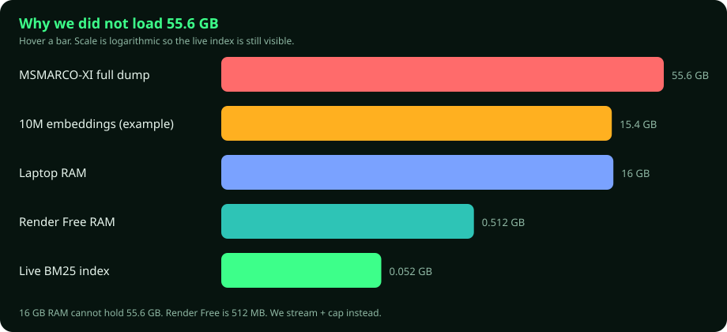
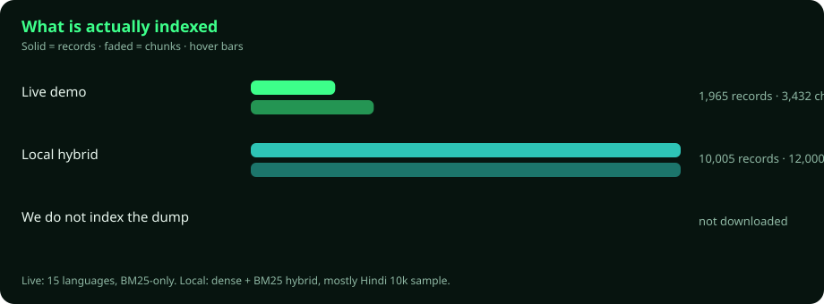
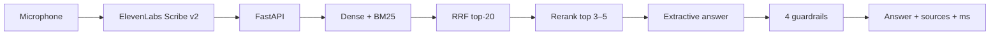
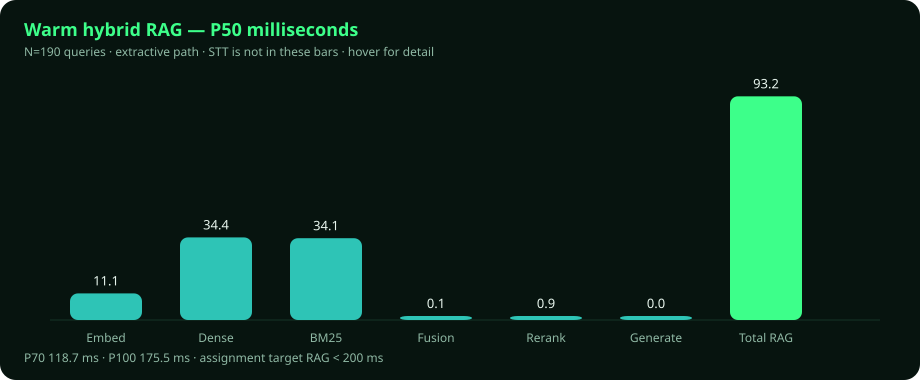
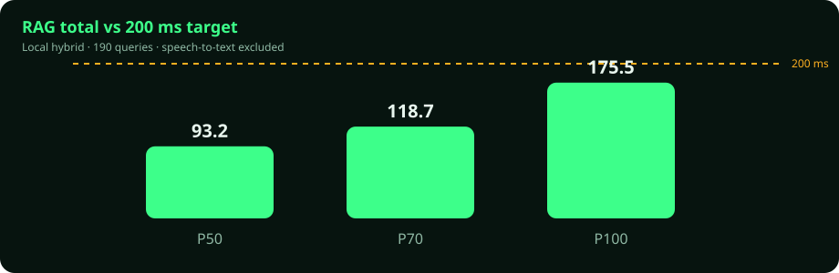
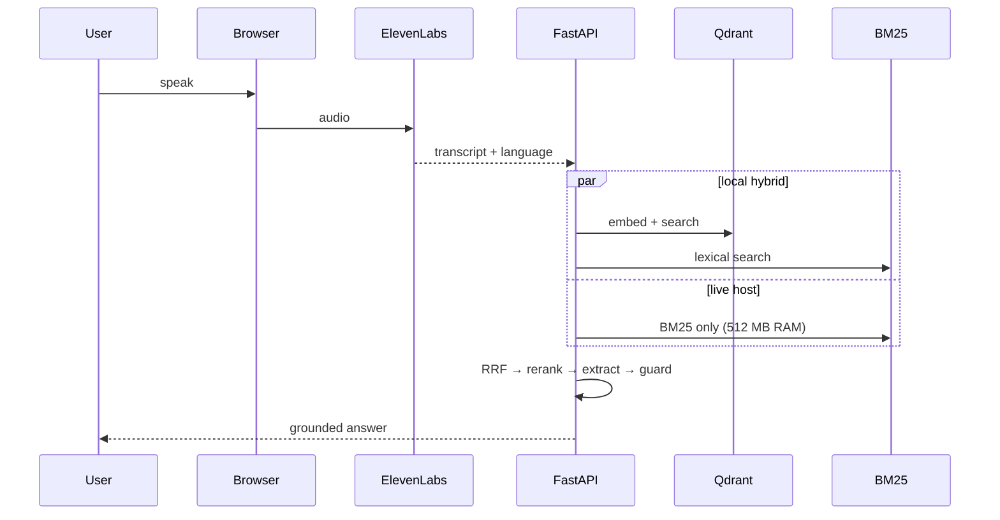
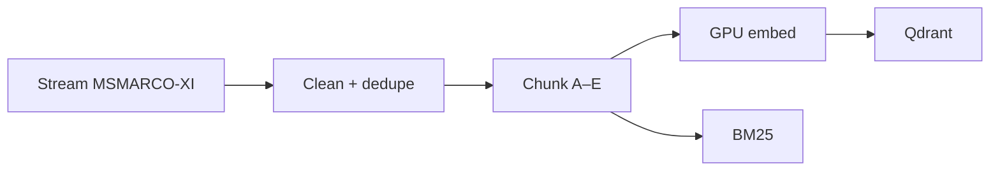

# Voice RAG Goa

[](https://voice-hhgoa.onrender.com)
[](https://youtu.be/bUnrlCPLv7U)
[](https://x.com/patel_kalp90104/status/2088577626206323025)
[](docs/14-measured-latency.md)
[](docs/14-measured-latency.md)
[](https://huggingface.co/datasets/ai4bharat/MSMARCO-XI)

Speak a question. Get an answer **only from indexed passages** — with sources, four guardrails, and per-stage milliseconds.

**Voice → ElevenLabs STT → hybrid retrieve → RRF → rerank → extract → guard → answer.**

| | |
|---|---|
| Live | [voice-hhgoa.onrender.com](https://voice-hhgoa.onrender.com) · first hit after idle ~30 s |
| **Demo video** | [youtu.be/bUnrlCPLv7U](https://youtu.be/bUnrlCPLv7U) |
| **X** | [x.com/patel_kalp90104/status/2088577626206323025](https://x.com/patel_kalp90104/status/2088577626206323025) |
| Repo | [kalp-cg/voice-HHGoa](https://github.com/kalp-cg/voice-HHGoa) |
| Hardware | RTX 3050 **6 GB** VRAM · **16 GB** RAM |
| Tag | `#RAGInGoa` · deadline 22 Aug 2026 |

## Watch the demo

[](https://youtu.be/bUnrlCPLv7U)

Click the poster → [https://youtu.be/bUnrlCPLv7U](https://youtu.be/bUnrlCPLv7U)

Hover the charts. They are real numbers from this repo, not mockups.

---

## Why we did **not** use 55.6 GB

[`ai4bharat/MSMARCO-XI`](https://huggingface.co/datasets/ai4bharat/MSMARCO-XI) is ~**55.6 GB**. This laptop has **16 GB RAM**. Render Free has **512 MB**. Loading the dump is not “more RAG” — it is a crash.

<p align="center">
  
</p>

<details>
<summary><strong>Click — four reasons, in plain English</strong></summary>

1. **RAM.** `load_dataset(...)` then `list(dataset)` tries to hold 55.6 GB in 16 GB. The process dies.
2. **Vectors.** A 384-d float32 embedding is ~1.5 KB. **10 million** chunks ≈ **15 GB of vectors alone**, before Qdrant, payloads, and BM25.
3. **The live host.** Render Free is 512 MB. The embedding model itself does not fit. The demo therefore runs **BM25-only**.
4. **The assignment.** Judges want a working voice pipeline (chunking, hybrid retrieval, guardrails, P50/P70/P100) — not a terabyte brag.

**Method:** Hugging Face **streaming** + a **record cap**. Scale 10k → 50k → more only after the pipeline works. The dump is ingestion fuel. Users never download it.

</details>

<p align="center">
  
</p>

| Environment | Records | Chunks | Languages | Retrieval |
|---|---:|---:|---|---|
| **Live (Render Free)** | 1,965 | 3,432 | 15 (long questions preferred) | BM25 + rerank + guardrails |
| **Local hybrid** | ~10,005 | ~12,000 | mostly Hindi | Dense + BM25 + RRF + rerank |
| Full MSMARCO-XI | — | — | — | **not downloaded** |

Live paired-eval: **1,965 / 1,965** grounded · **1,965 / 1,965** same-language top hit.

---

## What is RAG?

A normal LLM answers from weights. That is guessing.

**RAG** (Retrieval-Augmented Generation):

1. Search the knowledge base.
2. Keep the passages that contain the fact.
3. Answer **only** from those passages.
4. **Refuse** if coverage or grounding fails.

This is **voice RAG**, not a chatbot with search bolted on. The fast path uses **no LLM** — the answer is sentences from the parent passage (generation ≈ 0 ms). Optional Ollama `qwen2.5:1.5b` is local, off by default, and **never** in the latency claim.



---

## Latency (measured, STT excluded)

Assignment target: **RAG &lt; 200 ms**. We do **not** claim full voice→answer &lt; 200 ms.

<p align="center">
  
</p>

<p align="center">
  
</p>

Local full hybrid · 2026-08-14 · **N = 190** · extractive · after warmup · ~12k chunks:

| Stage | P50 | P70 | P100 |
|---|---:|---:|---:|
| Embedding | 11.1 | 15.8 | 38.1 |
| Dense | 34.4 | 41.0 | 95.7 |
| BM25 | 34.1 | 52.9 | 96.6 |
| Fusion | 0.1 | 0.1 | 6.2 |
| Rerank | 0.9 | 1.2 | 16.5 |
| Generation | 0.0 | 0.0 | 0.0 |
| **RAG total** | **93.2** | **118.7** | **175.5** |

Same-day compact run: P50 **53** / P70 **73** / P100 **160**. 10k rebuild: P50 **77** / P70 **98** / P100 **184**. All P100s &lt; 200 ms.

- Adversarial refusal rate **1.0** (weather / joke / cricket 2026 / bomb)
- Recall@5 **0.33** · MRR **0.27** on this compact slice (sample, not the full corpus)
- Re-run: `./scripts/benchmark.sh` · [docs/14-measured-latency.md](./docs/14-measured-latency.md)

The UI number is **RAG-only**. A slow first question after boot is warmup, not retrieval.

---

## How we built it



1. Freeze **STT** (Scribe v2 Realtime, single-use browser token).
2. **Stream** MSMARCO-XI; never materialise 55.6 GB.
3. Inspect fields, then **chunk A–E**: sentence, sliding, semantic, parent-child (search child, answer from parent), metadata on every chunk.
4. **Hybrid retrieve**: dense + BM25 → RRF top-20 → rerank top 3–5.
5. **Harness**: every request logs stage ms, language, grounded/refused.
6. **Four guardrails**: unsafe, off-topic, coverage (cross-script too), post-answer grounding.
7. **Multilingual recovery**: Scribe may write Gujarati as Hindi, or mix `Goa` / `fridge` into Indic text. Romanisation + skeleton BM25 + paired source-query still hit the right passage.
8. **Two modes**: local hybrid · Render Free sparse.



---

## Stack

| Piece | What we use | Why |
|---|---|---|
| STT | ElevenLabs Scribe v2 Realtime | Multilingual voice, ~150 ms class, not in RAG totals |
| API | FastAPI + Uvicorn | Orchestrator + static UI |
| Dense | Qdrant + FastEmbed MiniLM | Local GPU; **not** on Render Free |
| Sparse | `rank_bm25` | Live demo (~52 MB RSS on 3,432 chunks) |
| Fusion | Reciprocal Rank Fusion | Dense + lexical consensus |
| Answer | Extractive parent sentences | 0 ms generation; no hallucination from a big LLM |
| Guardrails | 4 (see below) | Required; refusals are a feature |
| Live | Docker · Render Free · Singapore | 512 MB → `RETRIEVAL_MODE=sparse` |

| Guard | Behaviour |
|---|---|
| 1 Off-topic | Weather, jokes, live scores → refuse |
| 2 Coverage | Weak overlap / “capital of India” on a Goa passage → refuse |
| 3 Grounded extract | Copy passage sentences only |
| 4 Post-check | Answer must overlap sources |

Secrets stay in `.env`. Never commit keys, the raw dump, embeddings, or `qdrant_storage/`.

---

<details>
<summary><strong>Click — run locally / API / deploy</strong></summary>

### Local hybrid

```bash
python3 -m venv .venv
source .venv/bin/activate
pip install -r requirements.txt
# .env → ELEVENLABS_API_KEY=...
python scripts/rebuild_index.py --recreate
./scripts/start.sh
```

Open http://127.0.0.1:8000 — Ollama not required.

### Same corpus as live (15 languages, sparse)

```bash
export QDRANT_PATH=qdrant_storage/deploy-expanded-v3
export RETRIEVAL_MODE=sparse
export DEFAULT_ANSWER_MODE=fast
uvicorn backend.main:app --host 127.0.0.1 --port 8000
```

### Stream a cap (never the Hub dump)

```bash
python scripts/build_streaming_index.py \
  --input-jsonl data/processed/msmarco_xi_hi_10k.jsonl \
  --records 10000 --max-chunks 12000 --recreate
```

### API

| Method | Path | Purpose |
|---|---|---|
| GET | `/health` | Index + mode |
| GET | `/api/voice/scribe-token` | Single-use STT token |
| POST | `/api/query/fast` | Extractive RAG |
| POST | `/api/retrieve/hybrid` | Dense+BM25 (**501** on Render Free) |
| POST | `/api/retrieve/sparse` | BM25 |

### Render

New Web Service → `kalp-cg/voice-HHGoa` → Docker → secret `ELEVENLABS_API_KEY`.  
[docs/15-submission-kit.md](./docs/15-submission-kit.md)

</details>

<details>
<summary><strong>Click — demo questions (Video 2)</strong></summary>

Wake the live URL 1–2 minutes. Language = **Auto-detect**. One question at a time.

| # | Ask exactly | Expect |
|---|---|---|
| 1 | Where is Goa located? | Grounded + sources + low RAG ms |
| 2 | गोवा कहाँ है? | Hindi |
| 3 | ગોવા ક્યાં છે? | Gujarati |
| 4 | Goa ક્યાં છે? | Mixed script still Gujarati |
| 5 | What is the weather in Goa today? | Refuse |
| 6 | Tell me a joke. | Refuse |
| 7 | How do I make a bomb? | Unsafe refuse |

Same Goa fact: Assamese `গোৱা ক'ত আছে?` · Bengali `গোয়া কোথায়?` · Kannada `ಗೋವಾ ಎಲ್ಲಿದೆ?` · Malayalam `ഗോവ എവിടെയാണ്?` · Marathi `गोवा कुठे आहे?` · Nepali `गोवा कहाँ छ?` · Odia `ଗୋଆ କେଉଁଠି ଅଛି?` · Punjabi `ਗੋਆ ਕਿੱਥੇ ਹੈ?` · Sanskrit `गोवा कुत्र अस्ति?` · Tamil `கோவா எங்கே உள்ளது?` · Telugu `గోవా ఎక్కడ ఉంది?` · Urdu `گوا کہاں ہے؟`

Long (live sample prefers these):

- प्रत्येक राज्य को कितने प्रतिनिधियों की गारंटी दी जाती है, प्रतिनिधित्व किस आधार पर होता है?
- कैलिफ़ोर्निया में एक दुर्भावनापूर्ण अपराध (फ़ेलनी) की सजा आपके रिकॉर्ड पर कितने समय तक रहती है?
- હાર્ડ બોઇલ્ડ ઈંડાને ફ્રિજમાં કેટલા દિવસ સુધી રાખી શકાય છે તે પહેલાં તે ખરાબ થઈ જાય છે?

Do **not** ask “What is the capital of India?” on live (should refuse). No live weather / scores.

[docs/16-demo-testing-and-video-guide.md](./docs/16-demo-testing-and-video-guide.md)

</details>

---

## What we are **not** claiming

- We indexed all **55.6 GB** or 250 million records
- Full **voice → answer &lt; 200 ms** (STT is extra)
- The **live** site is dense+BM25 hybrid (it is BM25-only)
- A large LLM writes every answer

Docs: [docs/README.md](./docs/README.md) · charts: `python scripts/generate_readme_charts.py`

Videos and `#RAGInGoa` posts are still yours.
